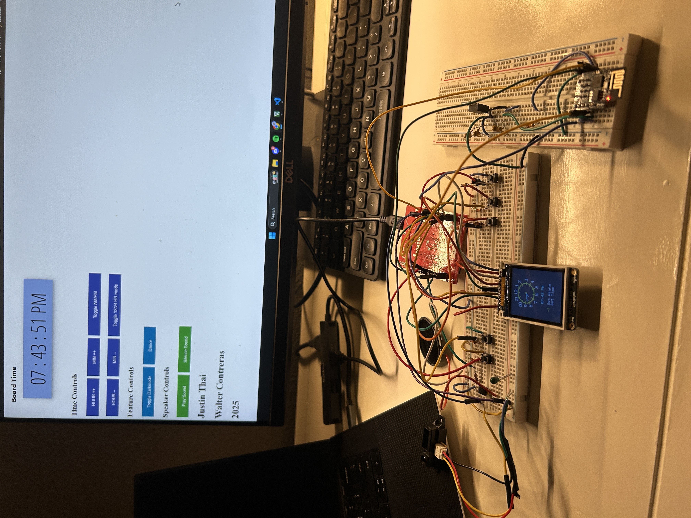
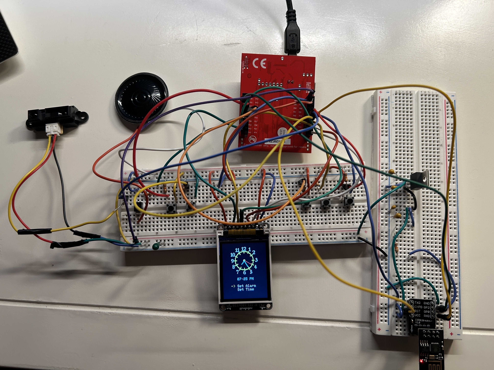
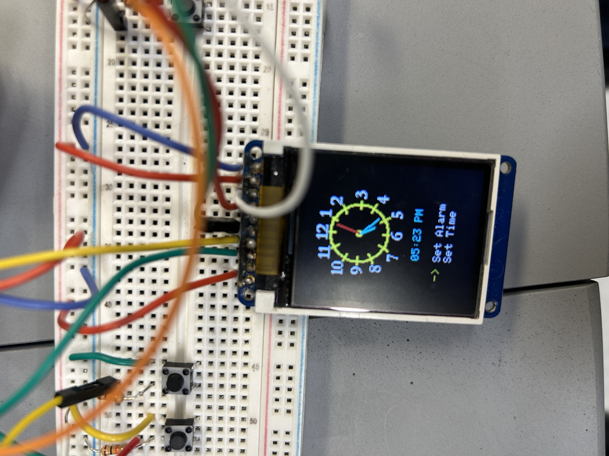

# IoT-Enabled Smart Alarm Clock 

## 📌 Overview

This project extends a traditional embedded alarm clock into an **IoT-enabled smart object**. Built with a **TM4C123 LaunchPad**, **ST7735 LCD**, and an **ESP8266 Wi-Fi module**, the system connects to an **MQTT broker** and a **web application**.

Through this setup, users can remotely:

* View the current time in real-time from a browser.
* Control the clock functions (increment/decrement hours, minutes, seconds, and toggle 12/24-hour mode).
* Control the alarm sound
* Toggle darkmode
* Make a guy dance (secret feature)


---

## 🛠️ Features

* **Real-Time Clock Display** on the LCD and in the web app.
* **MQTT Integration** for bidirectional communication between the embedded system and web interface.
* **Embedded System Controls**: Set Time, Set Alarm, Toggle 12/24 Hour mode, Toggle Darkmode, Silence Alarm by waving hand over the IR Distance Sensor, Make a guy dance (secret feature)
* **Web Application Controls**: Hour++, Hour--, Minute++, Minute--, Second++, Second--, Toggle 12/24, Toggle darkmode, Play Sound, Silence Sound
* **ESP8266 Wi-Fi Connectivity** with configurable SSID, password, broker, and port.
* **Low-Level Embedded Integration**: UART5 driver, timers, and periodic interrupts on the TM4C.


---

## 📡 System Architecture

```
Web App  <-->  MQTT Broker  <-->  ESP8266  <-->  TM4C123  <-->  LCD/Speaker/Clock/Switches/IR Sensor
```

* **Web App**: HTML/JS interface with MQTT over WebSockets.
* **MQTT Broker**: EMQX public broker.
* **ESP8266**: Acts as a UART–MQTT bridge.
* **TM4C123**: Runs alarm clock firmware extended with MQTT driver code.
* **LCD/Alarm Hardware**: Displays time and provides local feedback.

---

## 📷 Photos


* 
* 
* 

For more photos and schematics, please see the `images/` folder.

---

## ⚙️ Hardware

* **Texas Instruments TM4C123GXL LaunchPad**
* **ESP8266 Wi-Fi Module**
* **ST7735 LCD**
* **LM2937-3.3V regulator** 
* **8 Ohm speaker**
* **GP2Y0A41SK0F IR Sensor**
* **Push buttons, resistors, capacitors**

---

## 💻 Software

* **Embedded (TM4C)**: C code (uses UART, timers, periodic interrupts).
* **ESP8266**: Arduino `.ino` sketch (with PubSubClient + Blynk libraries).
* **Web App**: HTML, JavaScript, and CSS with MQTT over WebSockets.

---

## 🚀 Getting Started
0. **Build circuit**. See diagrams and photos.
1. **Flash ESP8266** with the `sw/src_ESP/src_ESP.ino` file using the Arduino IDE.
2. **Flash TM4C** with the `sw/src_TM4C/Lab4.uvprojx` project in Keil uVision5.
3. **Setup a local hotspot** with SSID = `JUSTIN` and password = `password`. Ensure it is configured to utilize the 2.4GHz band.
4. **Power on the TM4C**. If the local hotspot is configured as exactly above, the system will automatically connect and show the clock main menu screen.
3. **Open Web App** (`mqtt_app.htm`) in a browser. It should sync with the embedded alarm clock system after 1-2 seconds. You can now remotely control the alarm clock from the web app from anywhere! You don't need to be near the system!


---


## 👨‍💻 Authors

- Justin Thai
- Walter Contreras
- Fall 2025

---

